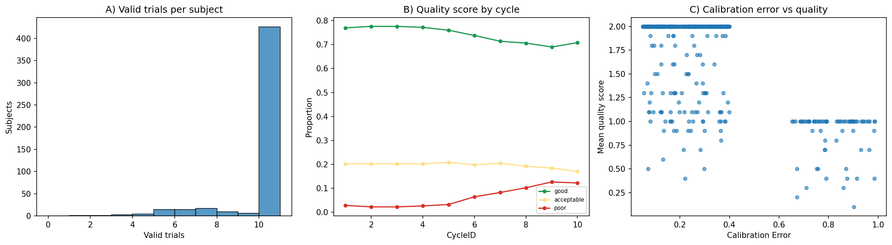
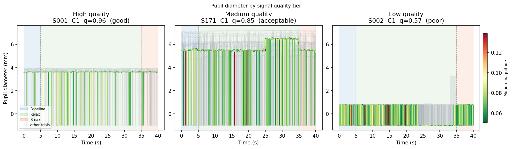
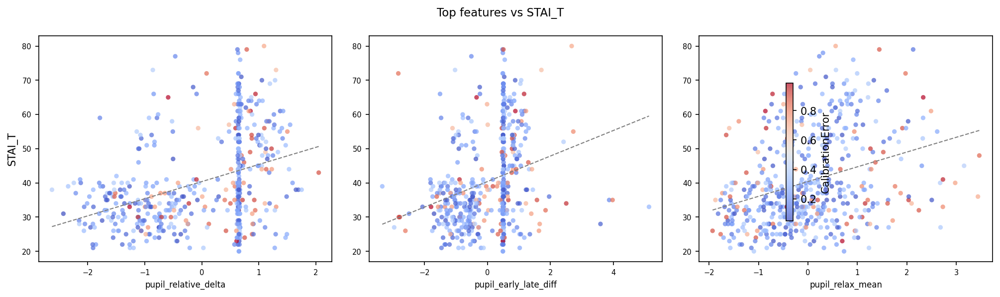
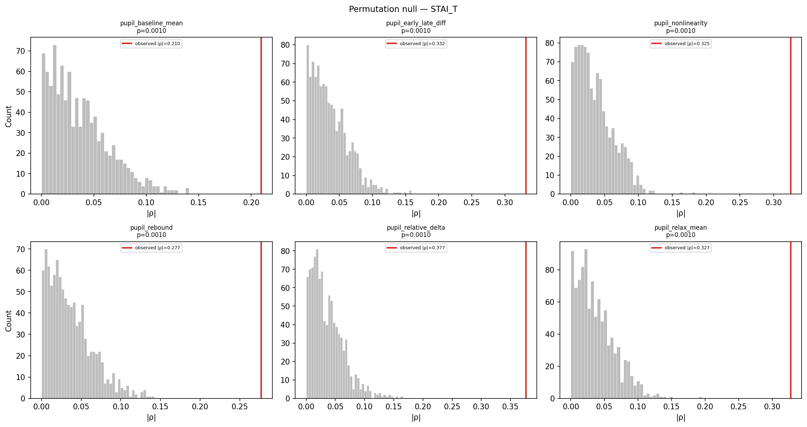
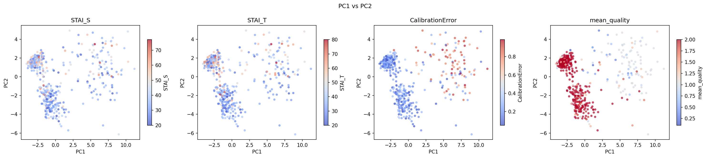
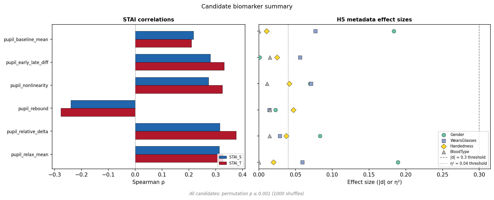
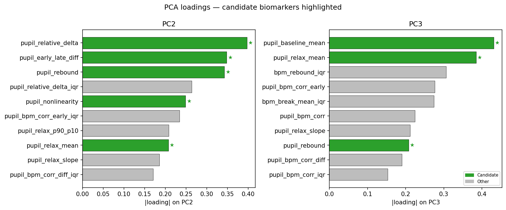

## The Assignment Overview

::: {.hero-band style="margin-bottom: 2rem;"}
**The Core Question:** Can a 40-second VR trial produce physiological signals reliable enough to serve as sensitive state biomarkers?
:::

<div class="overview-timeline">
<div class="overview-timeline__step overview-timeline__step--t1 fragment">
<div class="overview-timeline__number">1</div>
<div class="overview-timeline__content">
<strong>Reproducible Pipeline</strong><br>
<span>Signal validation, missing data masking, and trial quality scoring.</span>
</div>
</div>
<div class="overview-timeline__step overview-timeline__step--t2 fragment">
<div class="overview-timeline__number">2</div>
<div class="overview-timeline__content">
<strong>Physiological Features</strong><br>
<span>Candidate engineering & unsupervised dimensionality reduction (PCA).</span>
</div>
</div>
<div class="overview-timeline__step overview-timeline__step--t3 fragment">
<div class="overview-timeline__number">3</div>
<div class="overview-timeline__content">
<strong>Sensitivity & Scaling</strong><br>
<span>Proving robustness against confounds and preparing the architecture for API integration.</span>
</div>
</div>
</div>

::: notes
- This presentation maps exactly to the assignment brief.
- Step 1 handles the fundamental requirement: building a clean, reproducible preprocessing pipeline for messy physiological data.
- Step 2 covers the exploratory data analysis, physiological reasoning, and unsupervised methods.
- Step 3 addresses the difficult questions: how do we prove sensitivity over a single p-value, and how does this scale into a backend regulated product?
:::

## Hypotheses

```{=html}
<div class="card-grid">
  <div class="card fragment">
    <h3><i class="fa-solid fa-flask"></i> H1 · Task response</h3>
    <p>Physiological signals should change systematically from baseline to relaxation.</p>
  </div>
  <div class="card fragment">
    <h3><i class="fa-solid fa-ruler"></i> H2 · Relative features</h3>
    <p>Baseline-normalised features should capture the task better than raw levels alone.</p>
  </div>
  <div class="card fragment">
    <h3><i class="fa-solid fa-link"></i> H3 · Anxiety linkage</h3>
    <p>Pupil, heart-rate, and gaze-derived features should relate to STAI_S and STAI_T.</p>
  </div>
  <div class="card fragment">
    <h3><i class="fa-solid fa-shield-halved"></i> H4 · Sensitivity and specificity</h3>
    <p>Good biomarkers should survive quality/confound checks rather than only correlate once.</p>
  </div>
  <div class="card fragment">
    <h3><i class="fa-solid fa-tags"></i> H5 · Metadata confounds</h3>
    <p>Features strongly driven by demographics or acquisition context are weaker candidates.</p>
  </div>
  <div class="card fragment">
    <h3><i class="fa-solid fa-bullseye"></i> Focus</h3>
    <p>The heavy methodological effort goes into H4: demonstrating robustness, not only ranking features.</p>
  </div>
</div>
```

::: notes
- Reused from the notebook flow, condensed for slide readability.
- Stress H4 because the brief explicitly asks how sensitivity would be proven.
:::

## Data & Experimental Design

```{=html}
<div class="sdlc-flow fragment" data-fragment-index="1" style="margin: 0px 0 20px;">
  <div class="sdlc-step">
    <div class="ss-icon"><i class="fa-regular fa-circle-dot"></i></div>
    <div class="ss-label">Baseline</div>
    <div class="ss-sub">5 s</div>
  </div>
  <div class="sdlc-arrow-between"><i class="fa-solid fa-chevron-right"></i></div>
  <div class="sdlc-step" style="background-color: var(--accent-soft);">
    <div class="ss-icon"><i class="fa-solid fa-vr-cardboard"></i></div>
    <div class="ss-label">Relaxation</div>
    <div class="ss-sub">30 s</div>
  </div>
  <div class="sdlc-arrow-between"><i class="fa-solid fa-chevron-right"></i></div>
  <div class="sdlc-step">
    <div class="ss-icon"><i class="fa-solid fa-pause"></i></div>
    <div class="ss-label">Break</div>
    <div class="ss-sub">5 s</div>
  </div>
</div>
```

```{=html}
<div class="metric-strip" style="grid-template-columns: repeat(4, 1fr); gap: 14px; margin-bottom: 20px;">
  <div class="metric fragment" data-fragment-index="2"><div class="value">500</div><div class="label">subjects tracked</div></div>
  <div class="metric fragment" data-fragment-index="2"><div class="value">10</div><div class="label">trials per subject</div></div>
  <div class="metric fragment" data-fragment-index="2"><div class="value">40 s</div><div class="label">duration per trial</div></div>
  <div class="metric fragment" data-fragment-index="2"><div class="value">5</div><div class="label">confounds</div></div>
    <!-- <div class="metric fragment" data-fragment-index="2"><div class="value">5</div><div class="label">STAI target scores</div></div> -->
</div>
```

```{=html}
<div class="fragment" data-fragment-index="3" style="display: flex; justify-content: space-between; align-items: stretch; gap: 20px; margin-top: 36px; margin-bottom: 20px;">
  <div style="flex: 1.5; display: flex; flex-direction: column;">
    <div style="font-weight: 700; color: var(--ink); margin-bottom: 12px; font-size: 0.85em;">Signals Collected</div>
    <div class="pill-row" style="margin-top:0;">
      <div class="pill"><i class="fa-solid fa-eye"></i> Pupil</div>
      <div class="pill"><i class="fa-solid fa-location-crosshairs"></i> Gaze</div>
      <div class="pill"><i class="fa-solid fa-heart-pulse"></i> Pulse</div>
      <div class="pill"><i class="fa-solid fa-person-running"></i> Motion</div>
    </div>
  </div>
  <div class="callout" style="flex: 1; margin: 0; padding: 14px 18px; display: flex; align-items: center;">
    <div>
      <strong>Target:</strong> Self-report STAI state and STAI trait.
    </div>
  </div>
</div>
```

::: {.fragment data-fragment-index="4"}
```{=html}
<div class="hero-band" style="margin-top: 36px; padding: 16px 26px; display: flex; align-items: center; gap: 18px;">
  <div style="font-size: 1.8em; color: var(--accent);"><i class="fa-solid fa-lightbulb"></i></div>
  <div>
    <div style="font-weight: 700; color: var(--accent); font-size: 0.85em; margin-bottom: 3px;">Key Analytical Assumption</div>
    <div style="font-size: 0.68em; line-height: 1.4; color: var(--ink);">Controlled lab lighting implies pupil changes are driven directly by autonomic state, not ambient illuminance. To remain conservative, bad trials are dropped entirely rather than imputed.</div>
  </div>
</div>
```
:::

::: notes
- Trial structure: each 40 s trial = 5 s quiet baseline (eyes open, no stimulus) → 30 s VR relaxation content → 5 s recovery break. Features compare the baseline window to the relaxation window.
- STAI_S = State Anxiety Inventory — how anxious the person feels *right now*. STAI_T = Trait Anxiety Inventory — how anxious they tend to feel *in general*. Both are self-report questionnaires scored 20–80.
- "Self-report is noisy" means two people with the same physiology can give different scores depending on mood, introspection ability, or survey fatigue — hence why robustness checks matter more here.
:::

## Pipeline: Data Flow

```{=html}
<div class="flow-grid">
  <div class="flow-node fn-io">
    <div class="fn-title"><i class="fa-solid fa-file-csv"></i> Inputs</div>
    <div class="fn-sub">subjects.csv<br>timeseries.csv</div>
  </div>
  <div class="flow-arrow">&#8594;</div>
  <div class="flow-node">
    <div class="fn-title"><i class="fa-solid fa-filter"></i> Validation</div>
    <div class="fn-sub">per-sample masks<br>trial quality 0/1/2</div>
  </div>
  <div class="flow-arrow">&#8594;</div>
  <div class="flow-node">
    <div class="fn-title"><i class="fa-solid fa-wave-square"></i> Features</div>
    <div class="fn-sub">per-trial extraction<br>subject aggregation</div>
  </div>
  <div class="flow-arrow">&#8594;</div>
  <div class="flow-node">
    <div class="fn-title"><i class="fa-solid fa-magnifying-glass-chart"></i> Selection</div>
    <div class="fn-sub">redundancy removal<br>z-score · PCA</div>
  </div>
  <div class="flow-arrow">&#8594;</div>
  <div class="flow-node fn-io">
    <div class="fn-title"><i class="fa-solid fa-box-archive"></i> Outputs</div>
    <div class="fn-sub">parquet · CSV<br>plots · summaries</div>
  </div>
</div>
```

::: {.callout style="margin-top:18px; font-size:0.82em;"}
**Intermediate caching:** the `Features` step writes `per_trial_feature_catalog.parquet` to disk — Selection, PCA, and permutation tests re-run in seconds without re-processing validation.
:::

::: {.pill-row style="margin-top:10px;"}
<div class="pill">~2M rows → 500 subjects</div>
<div class="pill">Single-core</div>
<div class="pill">&lt; 2 GB RAM</div>
<div class="pill">Zero GPU deps</div>
:::

::: notes
- Solid arrows = data transformations (code runs); artifacts written to disk are checkpoints you can inspect or reuse.
- Intermediate caching: per_trial_feature_catalog.parquet is written after feature extraction. This decouples the slow signal-validation step from the fast statistical selection steps, enabling rapid iteration on thresholds and methods.
- Parquet is a compressed columnar file format — faster to read than CSV and preserves data types exactly.
- Compute footprint: the full pipeline processes ~2M time-series rows down to 500 subject-level vectors on a single core in under 2 minutes, using only pandas, scipy, and scikit-learn.
:::

## Validation: Per-Sample Masks

```{=html}
<div class="card-grid">
  <div class="card fragment">
    <h3><i class="fa-solid fa-eye"></i> Pupil</h3>
    <p>Non-missing, physiologically plausible (2–8 mm), and within median ± k·MAD.</p>
  </div>
  <div class="card fragment">
    <h3><i class="fa-solid fa-heart-pulse"></i> BPM</h3>
    <p>PPG sample retained only when signal-quality index exceeds threshold.</p>
  </div>
  <div class="card fragment">
    <h3><i class="fa-solid fa-location-crosshairs"></i> Gaze</h3>
    <p>Non-missing gaze without abrupt velocity jumps, again using a MAD-based rule.</p>
  </div>
  <div class="card fragment">
    <h3><i class="fa-solid fa-person-running"></i> Motion</h3>
    <p>High motion invalidates all sensors, so the motion mask gates the modality masks.</p>
  </div>
</div>
```

::: {.fragment .callout style="margin-top:16px;"}
Validation is deliberately conservative: robust statistics first, feature extraction second.
:::

::: notes
- MAD = Median Absolute Deviation. It measures spread like standard deviation but is not distorted by extreme outliers. Formula: MAD = median(|x_i − median(x)|). A sample is rejected if it falls more than k×MAD from the median. This is much more stable than mean ± k×std when the signal contains blink artifacts or motion spikes.
- "Cross-modal contaminant" = high motion corrupts *all* sensors simultaneously (pupil blurs, BPM spikes, gaze jumps), so the motion mask acts as a global gate applied before the per-sensor masks.
- Modality = type of sensor channel (pupil, BPM, gaze are three separate modalities).
:::

## Trial Quality & Outcomes

::: {.equation-box}
$$
q = 0.4 \cdot r_{pupil} + 0.4 \cdot r_{bpm} + 0.2 \cdot r_{gaze}
$$

where each $r$ is the valid-sample ratio for that modality within a trial.
:::

```{=html}
<div class="score-band">
  <div class="score-poor fragment" data-fragment-index="1">score 0<br><span class="small">&lt; 0.6 &middot; <strong>313 excluded</strong></span></div>
  <div class="score-ok fragment" data-fragment-index="2">score 1<br><span class="small">0.6–0.9 &middot; 982 retained</span></div>
  <div class="score-good fragment" data-fragment-index="3">score 2<br><span class="small">&#8805; 0.9 &middot; <strong>3705 retained</strong></span></div>
</div>
```

::: {.fragment data-fragment-index="4"}
```{=html}
<div style="display: flex; justify-content: center;">
  
</div>
```
:::

::: notes
- The quality score q is a weighted average of valid-sample ratios: pupil and BPM get 40% each (primary biomarker channels), gaze gets 20% (useful as an acquisition-quality indicator but not a direct biomarker here).
- Valid-sample ratio r = (number of unmasked samples) / (total samples in the window). A ratio of 1.0 means every sample passed all masks; 0.0 means every sample was rejected.
- Score 0 (q < 0.6) = excluded entirely; scores 1 and 2 are both retained for analysis but score 2 trials are used as the highest-confidence subset in sensitivity checks.
- Panel C shows that calibration status (whether the eye-tracker was re-calibrated during the session) correlates with trial quality score. This means quality score differences could partly reflect acquisition conditions, not only the subject's true physiology — which is why candidates are later screened against calibration as a confounder.
- Confounder = a variable that correlates with both the feature and the target (STAI), creating a spurious association. Calibration and demographics are the main confounders tested here.
:::

## Raw Signals: Quality In Practice

```{=html}
<div style="display: flex; justify-content: center; width: 100%;">
  
</div>

<div class="card-grid three" style="margin: 14px auto 0; width: 90%;">
  <div class="card">
    <h3 style="font-size: 1.1em; color: var(--accent); margin-bottom: 8px;"><i class="fa-solid fa-circle" style="color: #1b6b73;"></i> Subject S001</h3>
    <p style="font-size: 0.9em; margin-top: 0; margin-bottom: 4px; color: var(--ink);">10/10 valid trials</p>
    <p style="font-size: 0.85em; margin-top: 0; color: var(--muted);">Mean Quality Score: 2.0</p>
  </div>
  <div class="card">
    <h3 style="font-size: 1.1em; color: var(--accent); margin-bottom: 8px;"><i class="fa-solid fa-circle" style="color: #e5a428;"></i> Subject S171</h3>
    <p style="font-size: 0.9em; margin-top: 0; margin-bottom: 4px; color: var(--ink);">7/10 valid trials</p>
    <p style="font-size: 0.85em; margin-top: 0; color: var(--muted);">Mean Quality Score: 1.2</p>
  </div>
  <div class="card">
    <h3 style="font-size: 1.1em; color: var(--accent); margin-bottom: 8px;"><i class="fa-solid fa-circle" style="color: #d15656;"></i> Subject S002</h3>
    <p style="font-size: 0.9em; margin-top: 0; margin-bottom: 4px; color: var(--ink);">0/10 valid trials</p>
    <p style="font-size: 0.85em; margin-top: 0; color: var(--muted);">Mean Quality Score: N/A</p>
  </div>
</div>
```

::: notes
- Three rows = three representative trials: top = quality score 2 (high), middle = score 1 (medium), bottom = score 0 (excluded).
  - High: Clean pupil trace, minimal artifacts throughout.
  - Medium: Noticeable artifacts interrupt the signal mid-trial.
  - Low: Pervasive masking/data loss — trial excluded.
- RdYlGn_r colour scale: green = low motion magnitude, yellow = moderate, red = high. Motion magnitude is derived from head-tracking position changes.
- Per-sample masking means we do not discard the entire trial when a few samples are bad — we mask only the contaminated samples and compute features from the remaining clean ones. The trial-level quality score then summarises how many samples survived.
:::

## Feature Engineering: Per-Trial Physiology

```{=html}
<div class="card-grid three">
  <div class="card fragment">
    <h3><i class="fa-solid fa-battery-half"></i> Tonic state</h3>
    <p>Baseline mean and relax mean capture sustained pupil level, linked to tonic arousal.</p>
  </div>
  <div class="card fragment">
    <h3><i class="fa-solid fa-bolt"></i> Phasic response</h3>
    <p>Delta and rebound capture how strongly the signal changes and how it recovers.</p>
  </div>
  <div class="card fragment">
    <h3><i class="fa-solid fa-chart-line"></i> Temporal dynamics</h3>
    <p>Nonlinearity and early-vs-late difference capture adaptation across the 30 s relax window.</p>
  </div>
</div>
<div class="card-grid" style="margin-top:20px;">
  <div class="card fragment">
    <h3><i class="fa-solid fa-wave-square"></i> Variability</h3>
    <p>Within-trial spread and later subject-level IQR quantify instability, not just level.</p>
  </div>
  <div class="card fragment">
    <h3><i class="fa-solid fa-link-slash"></i> Cross-modal coordination</h3>
    <p>Pupil-BPM and related features were tested, but ultimately did not survive as candidates.</p>
  </div>
</div>
```

::: notes
- Tonic arousal = slow, sustained baseline level of physiological activation (e.g. resting pupil size). Linked to overall alertness or anxiety level.
- Phasic response = fast, stimulus-driven change superimposed on the tonic baseline. Pupil dilation during a relaxation stimulus is a phasic response.
- Delta = (relax mean − baseline mean), normalised by baseline mean → the relative change. A negative delta means the pupil shrank during relaxation, consistent with reduced arousal.
- Rebound = the pupil level in the last few seconds of the relax window minus the minimum. Captures how much the pupil "bounced back" after its initial dilation response.
- Nonlinearity and early-vs-late diff both capture whether the pupil response is steady or has a curved/changing trajectory across the 30 s window.
- All surviving candidates ended up pupil-based; BPM features did not survive robustness checks, likely due to PPG (photoplethysmography = optical pulse sensor) quality being too variable in a VR headset context.
:::

## From Per-Trial To Per-Subject

::: {.columns}
::: {.column width="58%"}
```{=html}
<div class="pipeline">
  <div class="pipeline-step"><span class="step-num">1</span><span class="step-label">Valid trials per subject</span><span class="step-detail">&nbsp;— up to 10 retained</span></div>
  <div class="pipeline-arrow">&#8595;</div>
  <div class="pipeline-step"><span class="step-num">2</span><span class="step-label">Per-trial feature extraction</span><span class="step-detail">&nbsp;— 39 features × trial</span></div>
  <div class="pipeline-arrow">&#8595;</div>
  <div class="pipeline-step"><span class="step-num">3</span><span class="step-label">Median aggregation + IQR</span><span class="step-detail">&nbsp;— robust central + spread</span></div>
  <div class="pipeline-arrow">&#8595;</div>
  <div class="pipeline-step"><span class="step-num">4</span><span class="step-label">Subject feature set</span><span class="step-detail">&nbsp;— 78 columns (39 + 39)</span></div>
  <div class="pipeline-arrow">&#8595;</div>
  <div class="pipeline-step"><span class="step-num">5</span><span class="step-label">Redundancy removal + quality join</span><span class="step-detail">&nbsp;— 57 remain</span></div>
</div>
```
:::
::: {.column width="42%"}
### Aggregation choices

::: {.fragment}
- Median over trials: robust to one or two borderline-quality trials surviving the mask
:::
::: {.fragment}
- IQR preserved: intra-subject instability is itself informative
:::
::: {.fragment}
- Redundancy removal *after* aggregation, not before — trial-level correlation is not subject-level correlation
:::
:::
:::

::: notes
- Aggregation flow: 39 per-trial features × up to 10 valid trials per subject → median and IQR computed per feature per subject → 78 subject-level columns (39 medians + 39 IQRs) → redundancy removal leaves 57.
- Median aggregation: for each subject we take the median value of a feature across their valid trials. More robust than the mean when one or two trials are borderline quality.
- IQR (Interquartile Range) = 75th percentile − 25th percentile across trials. Captures how consistent the subject's response was across trials — a high IQR means the feature was unstable trial-to-trial.
- Redundancy removal: drop features that are near-constant across subjects (no information) or that correlate > 0.9 with another feature (redundant).
:::

## Selection Funnel

```{=html}
<div class="pipeline">
  <div class="pipeline-step"><span class="step-num">1</span><span class="step-label">78 subject-level columns</span></div>
  <div class="pipeline-arrow">&#8595;</div>
  <div class="pipeline-step"><span class="step-num">2</span><span class="step-label">Remove near-constant &amp; highly correlated features</span></div>
  <div class="pipeline-arrow">&#8595;</div>
  <div class="pipeline-step"><span class="step-num">3</span><span class="step-label">Top-10 overlap by Spearman and Pearson</span></div>
  <div class="pipeline-arrow">&#8595;</div>
  <div class="pipeline-step"><span class="step-num">4</span><span class="step-label">Reject quality-driven features</span></div>
  <div class="pipeline-arrow">&#8595;</div>
  <div class="pipeline-step"><span class="step-num">5</span><span class="step-label">Permutation test</span><span class="step-detail">&nbsp;— 1000 label shuffles, p ≤ 0.001</span></div>
  <div class="pipeline-arrow">&#8595;</div>
  <div class="pipeline-step"><span class="step-num">6</span><span class="step-label">Metadata effect-size screen</span><span class="step-detail">&nbsp;— Gender, WearsGlasses, Handedness, BloodType, CalibrationError</span></div>
  <div class="pipeline-arrow">&#8595;</div>
  <div class="pipeline-step" style="background: var(--accent-soft); border-color: rgba(27,107,115,0.3); font-weight:700;"><span class="step-label" style="color:var(--accent);">6 candidate biomarkers</span></div>
</div>
```

::: {.fragment .callout style="margin-top:18px;"}
Each stage rejects a different failure mode — not a re-test of the same effect.
:::

::: notes
- Stage 1 — Spearman + Pearson overlap: Spearman tests monotonic rank correlation (robust to outliers and non-normal distributions); Pearson tests linear correlation (sensitive to outliers but has well-understood theory). Requiring a feature to rank top-10 in *both* filters out features that only look good under one assumption.
- Stage 2 — Quality-driven rejection: remove features whose correlation with STAI could be explained by quality score (i.e. better data → higher feature value → seemingly better STAI association, but it is actually a quality artifact).
- Stage 3 — Permutation test: shuffle STAI labels 1000 times and recompute the correlation each time. The real correlation must sit above the 99.9th percentile of this null distribution (p ≤ 0.001). This tests whether the observed association could appear by chance.
- Stage 4 — Metadata effect-size screen: five variables tested — Gender, WearsGlasses, Handedness, BloodType, CalibrationError. Features that correlate strongly with any of these are weaker candidates because part of their variance is explained by demographics or acquisition artefacts rather than physiology.
:::

## Correlation With STAI

::: {.columns}
::: {.column width="63%"}
{width=100%}
:::
::: {.column width="37%"}
### Main takeaways

- Strongest observed single-feature association: `pupil_relative_delta`, $\rho \approx 0.38$ with STAI_T 
- Trait anxiety aligns most clearly with tonic and recovery-related pupil features 
- Calibration colouring does not explain away the top effects
:::
:::

::: notes
- ρ (rho) = Spearman rank correlation coefficient. Range −1 to +1. |ρ| ≈ 0.1 = small, |ρ| ≈ 0.3 = moderate, |ρ| ≈ 0.5 = large (Cohen's conventions for behavioural data).
- A single physiological feature against a self-report questionnaire score rarely exceeds |ρ| ≈ 0.4 in a heterogeneous sample — moderate effects are the expected ceiling, not a limitation of this particular analysis.
- Calibration colouring: dots are colour-coded by whether the eye-tracker was recalibrated during the session. If the effect disappeared when colouring by calibration, it would suggest the association is an artifact of acquisition quality rather than physiology.
:::

## Permutation Test

{width=94%}

::: {.fragment .callout}
All six candidates clear $p \le 0.001$ against a 1000-shuffle null — no parametric assumptions.
:::

::: notes
- Permutation test logic: if the STAI labels have no real relationship to the features, then randomly shuffling the labels should produce correlations similar to the observed one. Repeating this 1000 times builds an empirical null distribution.
- p ≤ 0.001 means fewer than 1 in 1000 shuffles produced a correlation as strong as the real one. This is a non-parametric significance test — it does not assume normality or any particular distribution shape.
- "Fewer assumptions" = unlike a t-test or F-test, the permutation approach makes no assumptions about the distribution of the data; the null distribution is constructed entirely from the actual data.
:::

## PCA: What Drives Variance

{width=88% fig-align="center"}

::: {.fragment .callout style="margin-top:14px;"}
**PC1** is dominated by data quality. **PC2** is the most STAI-aligned axis. **PC3** carries the residual anxiety signal that PC2 does not. The honest claim: anxiety is the dominant *non-quality* source of variance.
:::

::: notes
- PCA (Principal Component Analysis): a dimensionality-reduction technique that finds uncorrelated directions (principal components, PCs) of maximum variance in the feature space. PC1 explains the most variance, PC2 the next most, and so on.
- PC1 is quality-dominated = the single largest source of variance across subjects is data quality, not anxiety. This makes sense: subjects with more valid samples will have more stable, extreme feature values.
- PC2 being anxiety-aligned = after accounting for quality-driven variance in PC1, the next largest pattern of variation across subjects correlates with STAI. This is the useful signal.
- "Measured claim" = PC2 still carries some quality/calibration association, so it is not a pure anxiety axis. The honest statement is that anxiety is the *dominant non-quality* source of variance.
:::

## Candidate Biomarkers

{width=100%}

::: {.footer-note}
Six surviving candidates, all pupil-derived, grouped into tonic arousal, phasic response/recovery, and temporal adaptation.
:::

::: notes
- Six candidates grouped by physiological theme:
  - Tonic (sustained level): `pupil_baseline_mean` and `pupil_relax_mean` — higher tonic pupil = higher sympathetic arousal.
  - Phasic/recovery: `pupil_relative_delta` (how much the pupil changed relative to baseline) and `pupil_rebound` (how much it recovered toward the end of the relax window).
  - Temporal dynamics: `pupil_nonlinearity` (curvature of the pupil trajectory across 30 s) and `pupil_early_late_diff` (first-half vs second-half mean difference).
- Rebound interpretation: a more negative `pupil_rebound` in higher-anxiety participants suggests their pupil did not return toward its pre-relaxation level — possibly indicating incomplete parasympathetic engagement.
- Sympathetic vs parasympathetic: the sympathetic nervous system drives arousal/stress (dilates pupil); the parasympathetic drives rest/relaxation (constricts pupil). Relaxation tasks should shift the balance toward parasympathetic.
:::

## Robustness Evidence Matrix

```{=html}
<div class="evidence-grid">
  <div class="head">Candidate</div>
  <div class="head">Dual corr.</div>
  <div class="head">Not quality-driven</div>
  <div class="head">Perm. p</div>
  <div class="head">Metadata</div>
  <div class="head">PCA support</div>
  <div class="head">Theme</div>

  <div class="cell rowname">pupil_relative_delta</div><div class="cell ok">✓</div><div class="cell ok">✓</div><div class="cell ok">≤ 0.001</div><div class="cell ok">small</div><div class="cell ok">PC2</div><div class="cell ok">phasic</div>
  <div class="cell rowname">pupil_rebound</div><div class="cell ok">✓</div><div class="cell ok">✓</div><div class="cell ok">≤ 0.001</div><div class="cell ok">small</div><div class="cell ok">PC2/3</div><div class="cell ok">recovery</div>
  <div class="cell rowname">pupil_early_late_diff</div><div class="cell ok">✓</div><div class="cell ok">✓</div><div class="cell ok">≤ 0.001</div><div class="cell ok">small</div><div class="cell ok">PC2</div><div class="cell ok">dynamics</div>
  <div class="cell rowname">pupil_nonlinearity</div><div class="cell ok">✓</div><div class="cell ok">✓</div><div class="cell ok">≤ 0.001</div><div class="cell ok">small</div><div class="cell ok">PC2/3</div><div class="cell ok">dynamics</div>
  <div class="cell rowname">pupil_relax_mean</div><div class="cell ok">✓</div><div class="cell ok">✓</div><div class="cell ok">≤ 0.001</div><div class="cell ok">small</div><div class="cell ok">PC3 + some PC2</div><div class="cell ok">tonic</div>
  <div class="cell rowname">pupil_baseline_mean</div><div class="cell ok">✓</div><div class="cell ok">✓</div><div class="cell ok">≤ 0.001</div><div class="cell ok">small</div><div class="cell warn">mainly PC3</div><div class="cell ok">tonic</div>
</div>
```

::: {.footer-note}
The point is convergence: no candidate survives because of one statistic alone.
:::

::: notes
- Convergent validity: the fact that features identified by univariate correlation (Spearman/Pearson) also load strongly on the anxiety-aligned PCs provides independent corroboration — two different methods point to the same candidates.
- PC loadings = the weight of each original feature on each principal component. A high loading on PC2 means that feature contributes strongly to the direction of variance most correlated with anxiety.
- PC2 and PC3 split the anxiety-related variance between them rather than concentrating it all in PC2. `pupil_baseline_mean` loads mainly on PC3 while others load on PC2; both PCs correlate with STAI, so this is still supportive evidence.
:::

## PCA Loadings: Independent Support

::: {.columns}
::: {.column width="58%"}
{width=100%}
:::
::: {.column width="42%"}
### Convergent validity

::: {.fragment}
- The same six features picked by univariate ranking also load on the STAI-aligned PCs
:::
::: {.fragment}
- Support spreads across PC2 and PC3 — no single clean latent factor, but two converging methods
:::
::: {.fragment}
- PCA serves as corroboration here, not as the discovery method
:::
:::
:::

## Pipeline: Code Architecture

```{=html}
<div style="display:grid; grid-template-columns: 1fr auto 1fr auto 1fr; gap:10px; align-items:center; font-size:0.6em; margin:10px 0;">
  <div>
    <div style="font-weight:700; color:var(--accent); margin-bottom:6px;">Entry points</div>
    <div class="pipeline-step"><span class="step-label">main.py</span><span class="step-detail">— CLI</span></div>
    <div class="pipeline-step"><span class="step-label">analysis.ipynb</span><span class="step-detail">— exploration</span></div>
    <div class="pipeline-step"><span class="step-label">FastAPI wrapper</span><span class="step-detail">— future</span></div>
  </div>
  <div style="text-align:center; color:var(--accent); font-size:1.4em;">&#8594;</div>
  <div>
    <div style="font-weight:700; color:var(--accent); margin-bottom:6px;">Orchestration</div>
    <div class="pipeline-step"><span class="step-label">pipeline.py</span><span class="step-detail">— run_preprocessing / run_analysis</span></div>
    <div style="margin-top:10px; font-weight:700; color:var(--accent); margin-bottom:6px;">Configuration</div>
    <div class="pipeline-step"><span class="step-label">constants.py</span><span class="step-detail">— thresholds, weights</span></div>
  </div>
  <div style="text-align:center; color:var(--accent); font-size:1.4em;">&#8594;</div>
  <div>
    <div style="font-weight:700; color:var(--accent); margin-bottom:6px;">Core modules</div>
    <div class="pipeline-step"><span class="step-label">validation.py</span></div>
    <div class="pipeline-step"><span class="step-label">features.py</span></div>
    <div class="pipeline-step"><span class="step-label">selection.py</span></div>
    <div class="pipeline-step"><span class="step-label">plotting.py</span></div>
  </div>
</div>
```

::: {.fragment .callout style="margin-top:14px;"}
Intentionally lightweight: pandas, scipy, scikit-learn — no deep-learning dependencies. The pipeline is auditable, portable, and easy to freeze for regulated release.
:::

::: notes
- CLI and notebook share the same core modules; the notebook bypasses `pipeline.py` for finer control during exploration.
- A FastAPI wrapper is a thin layer over `pipeline.py`, not a rewrite — this is what makes the backend conversation credible.
- `constants.py` localises thresholds and weights, so re-tuning a parameter does not require hunting through modules.
- Deliberately avoiding heavy ML frameworks keeps the dependency surface small — important for regulated products where every dependency must be validated and pinned.
:::

## Production Architecture

```{=html}
<div style="display:grid; grid-template-columns: 1fr 1fr; gap:14px;">
<div>
<div class="flow-step fragment">
  <div class="fs-num">1</div>
  <div class="fs-body">
    <div class="fs-title"><i class="fa-solid fa-cloud-arrow-up"></i> Ingestion</div>
    <div class="fs-detail">POST /ingest-session — schema-validated upload from VR client</div>
    <div class="fs-tools"><span class="tool-tag">FastAPI</span><span class="tool-tag">Pydantic</span><span class="tool-tag">JWT auth</span></div>
  </div>
</div>
<div class="flow-arrow-v">&#8595;</div>
<div class="flow-step fragment">
  <div class="fs-num">2</div>
  <div class="fs-body">
    <div class="fs-title"><i class="fa-solid fa-database"></i> Storage</div>
    <div class="fs-detail">Raw timeseries, subject metadata, processing logs</div>
    <div class="fs-tools"><span class="tool-tag">S3</span><span class="tool-tag">PostgreSQL</span><span class="tool-tag">Parquet</span></div>
  </div>
</div>
<div class="flow-arrow-v">&#8595;</div>
<div class="flow-step fragment">
  <div class="fs-num">3</div>
  <div class="fs-body">
    <div class="fs-title"><i class="fa-solid fa-gears"></i> Async processing</div>
    <div class="fs-detail">Job queue → worker calls run_preprocessing(): validate → score trials → features → aggregate</div>
    <div class="fs-tools"><span class="tool-tag">Celery / RQ</span><span class="tool-tag">Redis</span><span class="tool-tag">src/pipeline.py</span></div>
  </div>
</div>
</div>
<div>
<div class="flow-step fragment">
  <div class="fs-num">4</div>
  <div class="fs-body">
    <div class="fs-title"><i class="fa-solid fa-chart-bar"></i> Analysis &amp; scoring</div>
    <div class="fs-detail">run_analysis() applies frozen z-score parameters from training cohort</div>
    <div class="fs-tools"><span class="tool-tag">zscore_params.csv</span><span class="tool-tag">scikit-learn</span><span class="tool-tag">feature store</span></div>
  </div>
</div>
<div class="flow-arrow-v">&#8595;</div>
<div class="flow-step fragment">
  <div class="fs-num">5</div>
  <div class="fs-body">
    <div class="fs-title"><i class="fa-solid fa-server"></i> Serving</div>
    <div class="fs-detail">GET /subject-features/{id} · GET /quality-report/{id}</div>
    <div class="fs-tools"><span class="tool-tag">FastAPI</span><span class="tool-tag">cached results</span></div>
  </div>
</div>
<div class="flow-arrow-v">&#8595;</div>
<div class="flow-step fragment">
  <div class="fs-num">6</div>
  <div class="fs-body">
    <div class="fs-title"><i class="fa-solid fa-bell"></i> Monitoring</div>
    <div class="fs-detail">Signal-quality drift, feature drift, failure rate by device cohort</div>
    <div class="fs-tools"><span class="tool-tag">Prometheus</span><span class="tool-tag">Grafana</span><span class="tool-tag">alerts</span></div>
  </div>
</div>
</div>
</div>
```

::: {.fragment .callout style="margin-top:14px;"}
**Already separable.** `run_preprocessing()` and `run_analysis()` in `src/pipeline.py` map directly onto stages 3–4 — the API is a thin wrapper, not a rewrite. Saved `zscore_params.csv` lets new subjects be scored against the training distribution without recomputing on the full cohort.
:::

::: notes
- Ingestion separates I/O bound work from compute. Pydantic validates schema and ranges before the worker spins up.
- Storage layer: S3 for raw timeseries (cheap, large), PostgreSQL for subject metadata and job state, Parquet feature store for downstream queries.
- Async processing keeps the API responsive: a 30 s upload returns instantly with a job ID; the worker pool handles the heavy lifting.
- Frozen z-score params are the key to incremental scoring — new cohorts do not change the standardisation, so per-subject scores remain comparable across releases.
- Monitoring closes the loop: drift in signal quality, feature distributions, or failure rates by device triggers alerts before the next regulated release.
:::

## Regulated Development & Code Freezes

```{=html}
<div class="process-strip">
  <div class="process-cell"><div class="pc-num">1</div><div class="pc-title"><i class="fa-solid fa-code-branch"></i> Develop</div><div class="pc-detail">feature branch<br>MLflow tracking<br>DVC dataset version</div></div>
  <div class="process-cell"><div class="pc-num">2</div><div class="pc-title"><i class="fa-solid fa-vial-circle-check"></i> Pre-freeze</div><div class="pc-detail">CI: unit + schema tests<br>baseline output diff</div></div>
  <div class="process-cell"><div class="pc-num">3</div><div class="pc-title"><i class="fa-solid fa-snowflake"></i> Freeze</div><div class="pc-detail">release branch<br>pin deps<br>lock feature defs</div></div>
  <div class="process-cell"><div class="pc-num">4</div><div class="pc-title"><i class="fa-solid fa-clipboard-check"></i> Validate</div><div class="pc-detail">locked-dataset rerun<br>sign-off in QMS</div></div>
  <div class="process-cell"><div class="pc-num">5</div><div class="pc-title"><i class="fa-solid fa-rocket"></i> Release</div><div class="pc-detail">tagged version<br>artifact bundle hash</div></div>
  <div class="process-cell" style="background:var(--accent-soft);"><div class="pc-num">6</div><div class="pc-title"><i class="fa-solid fa-rotate"></i> Post-freeze</div><div class="pc-detail">version bump<br>full re-validation<br>past versions reproducible</div></div>
</div>
```

::: {.columns}
::: {.column width="55%"}
### When something needs to change

```{=html}
<div class="decision-flow">
  <div class="decision-node dn-question">Change request arrives</div>
  <div class="flow-arrow-v">&#8595;</div>
  <div class="decision-node dn-question">Hotfix on a tagged release?</div>
  <div class="decision-branches">
    <div class="decision-branch">
      <div class="decision-label">Yes</div>
      <div class="decision-step">Patch branch from tag</div>
      <div class="flow-arrow-v">&#8595;</div>
      <div class="decision-step">Re-validate on locked dataset</div>
      <div class="flow-arrow-v">&#8595;</div>
      <div class="decision-node dn-terminal">Patch tag (v1.0.1)</div>
    </div>
    <div class="decision-branch">
      <div class="decision-label">No — new feature</div>
      <div class="decision-step">Feature branch from main</div>
      <div class="flow-arrow-v">&#8595;</div>
      <div class="decision-step">CI + baseline diff</div>
      <div class="flow-arrow-v">&#8595;</div>
      <div class="decision-node dn-terminal">Release branch + version bump</div>
    </div>
  </div>
</div>
```
:::
::: {.column width="45%"}
### What ties a release together

::: {.fragment}
- **Code commit hash** — Git tag
:::
::: {.fragment}
- **Dataset version** — DVC / MLflow run
:::
::: {.fragment}
- **Feature schema** — frozen at release
:::
::: {.fragment}
- **Model artifact** — MLflow model registry
:::
::: {.fragment}
- **Validation report** — QMS sign-off in Confluence
:::

::: {.fragment .callout style="margin-top:14px;"}
New data improves the system through controlled reprocessing and versioned model updates — never silent changes to a deployed version.
:::
:::
:::

::: notes
- A code freeze is not a code stop. You branch a release line, lock dependencies and feature definitions, and continue developing on main.
- Every release ties together five artifacts so any past output can be reproduced bit-for-bit: code commit, dataset version, feature schema, model artifact, and the validation report that signed off on it.
- The decision flow on the left answers the most common interview question: "what happens when a bug appears in production after freeze?" — patch from the tag, re-validate, ship a patch tag. Never edit a frozen branch in place.
- DVC and MLflow are the two pieces missing from the current repo: DVC for dataset versioning, MLflow for experiment tracking and model registry. Both are git-friendly and don't change the existing pipeline structure.
:::

## Limitations & Next Steps

```{=html}
<div class="card-grid">
  <div class="card fragment">
    <h3><i class="fa-solid fa-chart-pie"></i> Effect-size ceiling</h3>
    <p>Single-feature ρ ≈ 0.4 against a self-report target is at the upper end of what is typical. Honest scope, not a flaw to fix.</p>
  </div>
  <div class="card fragment">
    <h3><i class="fa-solid fa-heart-crack"></i> BPM under-delivered</h3>
    <p>VR PPG is motion-sensitive; cardiac features did not survive robustness checks. Better optical placement or ECG would change this.</p>
  </div>
  <div class="card fragment">
    <h3><i class="fa-solid fa-brain"></i> No predictive model yet</h3>
    <p>Next step: elastic-net regression with nested cross-validation to build a parsimonious multivariate index and honest generalisation estimates.</p>
  </div>
  <div class="card fragment">
    <h3><i class="fa-solid fa-arrow-trend-down"></i> Habituation unmodelled</h3>
    <p>Trial 1 differs from trial 10 as subjects acclimate. A mixed-effects model with trial index would isolate this variance.</p>
  </div>
  <div class="card fragment">
    <h3><i class="fa-solid fa-users-viewfinder"></i> Responder subtypes unexplored</h3>
    <p>Density-based clustering (HDBSCAN) or hierarchical clustering could reveal physiological responder subtypes without forcing artificial partitions on a continuous distribution.</p>
  </div>
  <div class="card fragment">
    <h3><i class="fa-solid fa-arrow-right-arrow-left"></i> Cross-cohort validation</h3>
    <p>The frozen z-score params are designed for incremental scoring. They need a held-out cohort to confirm generalisation.</p>
  </div>
</div>
```

::: notes
- Frame the limitations as scope choices, not failures. The audience will respect honesty about ceiling effects more than oversold claims.
- Elastic-net + nested CV: elastic-net combines L1 (feature selection) and L2 (shrinkage) penalties for a parsimonious model; nested CV ensures the performance estimate is not contaminated by the hyperparameter search.
- HDBSCAN is preferred over K-Means or UMAP because it does not force a fixed number of clusters and handles noise natively — important for a continuous physiological distribution where artificial partitioning would be misleading.
- Habituation modelling is the most concrete next methodological step; mixed-effects with trial index would change the picture for tonic features that drift across the session.
- Cross-cohort validation is the gating item before any clinical or product claim.
:::

## Closing

::: {.hero-band}
Six validated pupil biomarkers. A pipeline that is already separable, traceable, and deployable. The process discipline to carry it into a regulated product.
:::

::: {.pill-row}
<div class="pill fragment"><i class="fa-solid fa-check-double"></i> Validate first</div>
<div class="pill fragment"><i class="fa-solid fa-magnifying-glass"></i> Stay interpretable</div>
<div class="pill fragment"><i class="fa-solid fa-award"></i> Earn the claim</div>
:::

::: {.fragment style="margin-top:18px; font-size:0.75em; color:var(--muted, #6b7a8d); text-align:center;"}
Time allocation &nbsp;·&nbsp; 1.5 h pipeline &nbsp;·&nbsp; 1 h features &nbsp;·&nbsp; 1 h PCA & selection &nbsp;·&nbsp; 1 h report &nbsp;=&nbsp; **4.5 h total**
:::

::: notes
- Three discussion areas to invite:
  1. Physiology — why pupil, what BPM would add with cleaner sensors.
  2. Methodology — permutation vs parametric, redundancy thresholds, how a predictive model would be set up.
  3. Engineering and regulated process — deployment, code freeze handling, dataset versioning across cohorts.
:::